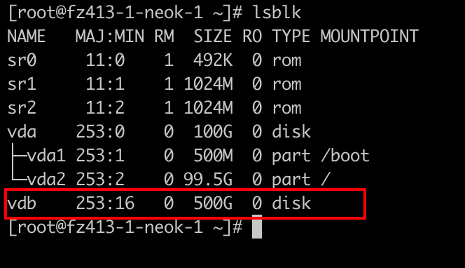
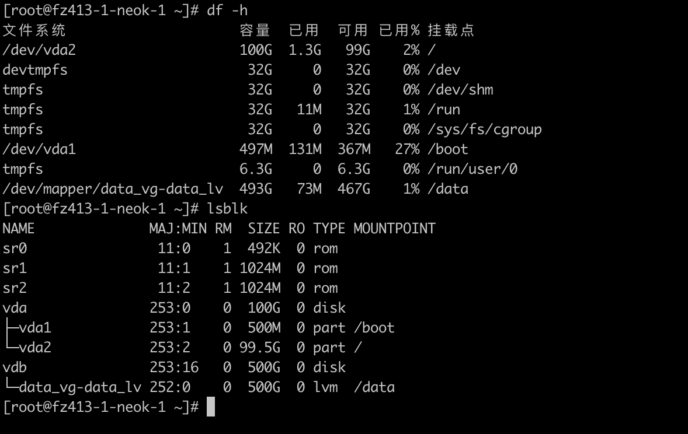

### LVM 概念简介

LVM 是 Linux 系统中用于管理磁盘驱动器和类似存储设备的一种方法。它提供了比传统的分区管理更多的灵活性。LVM 允许用户创建、调整、重新分配存储空间，而无需关心底层物理硬盘的具体分布。

### LVM 的主要组件

1. 物理卷（Physical Volumes, PVs）：
这些是 LVM 的基础。一个物理卷可以是一个完整的硬盘，一个硬盘的分区，或者甚至是一个 RAID 数组。在 LVM 中，物理卷是存储的最底层单元。
2. 卷组（Volume Groups, VGs）：
卷组是一种高级抽象，它允许你将多个物理卷组合成一个大的存储池。你可以将一个或多个物理卷添加到一个卷组中。卷组让你把物理存储设备的细节抽象化，让管理更加灵活和方便。
3. 逻辑卷（Logical Volumes, LVs）：
在一个卷组内，你可以创建多个逻辑卷。这些逻辑卷就像传统的分区，但它们拥有更多的灵活性。你可以在不影响数据的情况下动态地调整它们的大小，或者将它们跨越多个物理卷。

### LVM 的优势

- 灵活性： LVM 允许你在不中断服务的情况下动态调整存储空间。你可以轻松地增加、减少逻辑卷的大小，或将新的物理卷添加到卷组中。
- 易于管理： 对于复杂的存储需求，LVM 提供了简化管理的方法。它允许管理员使用简单的命令来管理大量的存储空间。
- 快照功能： LVM 支持快照功能，允许你在特定时间点创建存储状态的快照，这对于备份和恢复非常有用。
- 跨多个磁盘： LVM 可以轻松跨多个物理磁盘扩展，这意味着你可以创建一个比任何单个物理磁盘都大的逻辑卷。

### 使用场景

- 动态存储需求： 当你不确定需要多少存储空间，或者你的存储需求可能会随时间变化时，LVM 是一个理想的选择。
- 数据中心和服务器： 对于需要高度灵活和可扩展存储解决方案的数据中心和服务器，LVM 提供了强大的工具。
- 高级备份和恢复： LVM 的快照功能对于执行实时备份和快速恢复非常有用。

### 实际需求

需求说明：平台部署至客户服务器，目前服务器磁盘目前为500GB，平台运行占用磁盘空间无法确定大小，所以先将其中一块硬盘挂载到 /data 目录下，后期如果不够用再将其它硬盘扩容到 /data 目录下，这可以通过使用 LVM 实现，LVM 允许你以后方便地扩展存储空间。下面是详细的步骤：


#### 挂载 /dev/vdb 到 /data

1. 安装 LVM
```bash
yum install lvm2
```

2. 安装完成后，你可以通过检查 LVM 版本来验证它是否正确安装
```bash
lvm version
```

3. 确保 LVM 服务在启动时自动运行
```bash
systemctl enable lvm2-lvmetad
```

4.  查看现有磁盘-确认 /dev/vdb 是否存在
```bash
lsblk
```

5. 创建物理卷（Physical Volume, PV）
```bash
sudo pvcreate /dev/vdb
```

6.  创建卷组（Volume Group, VG）-创建一个新的卷组。这里以 data_vg 为例
```bash
sudo vgcreate data_vg /dev/vdb
```

7. 创建逻辑卷（Logical Volume, LV）-创建一个新的逻辑卷。以 data_lv 为例，使用卷组 data_vg 的所有可用空间
```bash
sudo lvcreate -l +100%FREE -n data_lv data_vg
```

8. 格式化逻辑卷-通常使用 ext4 文件系统
```bash
sudo mkfs.ext4 /dev/data_vg/data_lv
```

9. 创建挂载点并挂载逻辑卷
```bash
sudo mkdir -p /data
sudo mount /dev/data_vg/data_lv /data
```

10. 更新 fstab 以确保启动时自动挂载-编辑 /etc/fstab 文件，添加以下行
```bash
/dev/data_vg/data_lv /data ext4 defaults 0 2
```



#### 将来扩展 /data 目录

1. 当你有一个新硬盘（比如 /dev/vdc）时，首先要创建一个新的物理卷
```bash
sudo pvcreate /dev/vdc
```

2. 扩展卷组-将新的物理卷添加到现有的卷组 data_vg 中
```bash
sudo vgextend data_vg /dev/vdc
```

3. 扩展逻辑卷-扩展 data_lv 以使用新添加的空间。例如，将逻辑卷扩展到新的最大大小
```bash
sudo lvextend -l +100%FREE /dev/data_vg/data_lv
```

4. 调整文件系统大小-最后，你需要扩展文件系统以使用新的逻辑卷大小。对于 ext4 文件系统，可以使用

```bash
sudo resize2fs /dev/data_vg/data_lv
```
